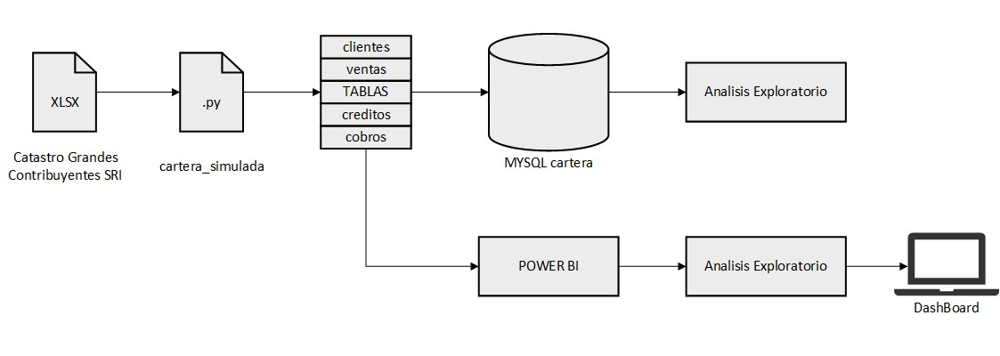

## Proyecto de Gestion de Cartera

---

### Resumen
El presente proyecto busca simular el comportamiento de la cartera de créditos de una empresa "x" para luego realizar un análisis exploratorio y extraer información e indicadores relevantes afines
al Area de Crédito y Cobranzas que permitirán una gestion adecuada de la cartera de créditos

#### Resultados del Analisis Exploratorio [Enlace al Portafolio](https://faustocasanova.github.io/PYCR_01_report.html)
  
---

### Requisitos de Software y Librerias 
- MYSQL WorkBench Version: 8.0.32
  
- Python version 3.9
  ```
  import pandas as pd
  import numpy as np
  import random
  
  from datetime import timedelta
  import sqlalchemy
  from sqlalchemy import create_engine
  ``` 

---
     
### Estructura
El proyecto esta dividido en 3 secciones:
- [ ] Python   - Simula los datos y crea las tablas a usar
- [ ] MYSQL    - Analisis exploratorio a partir de las tablas
- [ ] Power BI - Analisis exploratorio a partir de las tablas

  

---

### Consideraciones en los Datos Simulados

Python - cartera_simulada.py
  - [ ] | Tabla clientes |
    * Apartir del archivo Catastro Grandes Contribuyentes SRI.xlsx se simuló tener una cartera de 50 clientes aleatorios.

  - [ ] | Tabla ventas |
    * Se simularon 5000 ventas a credito que tuvieron lugar entre los dias laborales del 2021-01-01 y 2021-06-30
      
  - [ ] | Tabla creditos |
    * Del total de 5000 ventas a credito se consideró establecer una Politica de otorgar entre 15 a 45 dias de plazo
    * Por simplicidad se consideró que la Fecha en la que se otorga el credito sea la misma que la Fecha de la Factura
    * La Fecha de vencimiento del credito se asigno aleatoriamente considerando la Politica de credito
   
  - [ ] | Tabla cobros |
    * Por simplicidad los pagos de los clientes son de monto unico y no por cuotas o abonos
    * Se simulo un comportamiento de pago de los clientes asignandoles una probabilidad del 70% a 80% en pagar su credito a tiempo y la diferencia en pagarlo fuera de la fecha de vencimiento
    * De los pagos vencidos ademas se simuló los dias vencidos con las siguientes probabilidades
      ```
      - dias_vencido = [15, 30, 45, 60, 90]
      - probabilidad = [0.65, 0.15, 0.05, 0.05, 0.1]   
      ```

---

### Analisis Exploratorio - MYSQL
Dentro del analisis exploratorio se busca obtener cierta informacion relevante para saber el estado actual de la cartera de creditos en el primer semestre del año 2021.
Por lo que se buscará responder las preguntas siguientes:

#### Analisis General
- [ ] 1) Cuantos creditos se otorgaron por cada mes y cual fue su Monto Total respectivo ?
- [ ] 2) Cuantos creditos se cobraron por cada mes y  cual fue su Monto Total respectivo ?
- [ ] 3) Calcular el Monto Acumulado de la cartera de credito por mes 
- [ ] 4) Calcular el Monto Acumulado de los cobros de credito por mes
- [ ] 5) Calcular el Saldo Pendiente de cobro al final de cada mes
- [ ] 6) Calcular la Cartera Bruta de cada mes donde:
  ```
  Cartera Bruta = Saldo Pendiente de cobro del mes anterior + Monto de creditos otorgados en el mes actual
  ```
- [ ] 7) Que porcentage de la Cartera fue cobrado cada mes ?   
- [ ] 8) Que porcentage de la cartera esta pendiente de cobro ?

#### Analisis Cartera Cobrada
- [ ] 9)  Del Monto Total cobrado por mes que Monto      fue cobrado A Tiempo y que cual fue cobrado con Fecha Vencida 
- [ ] 10) Del Monto Total cobrado por mes que Porcentage fue cobrado A Tiempo y que cual fue cobrado con Fecha Vencida

#### Analisis Cartera Pendiente de Cobro
- [ ] 11) Del Saldo pendiente por cobrar que Monto y cuantos creditos se mantiene Vigentes y cuales estan Vencidos , por mes 
- [ ] 12) De los Montos Vencidos asignarle una clasificacion en base a los dias que tienen vencidos 
- [ ] 13) Que porcentage de la cartera total representa cada clasificacion ?


---

### Analisis Exploratorio - POWER BI
En este analisis se busca responder las mismas preguntas anteriores pero mediante la creacion de Medidas DAX adecuadas y un Dashboard que resuma la informacion en Power BI 


